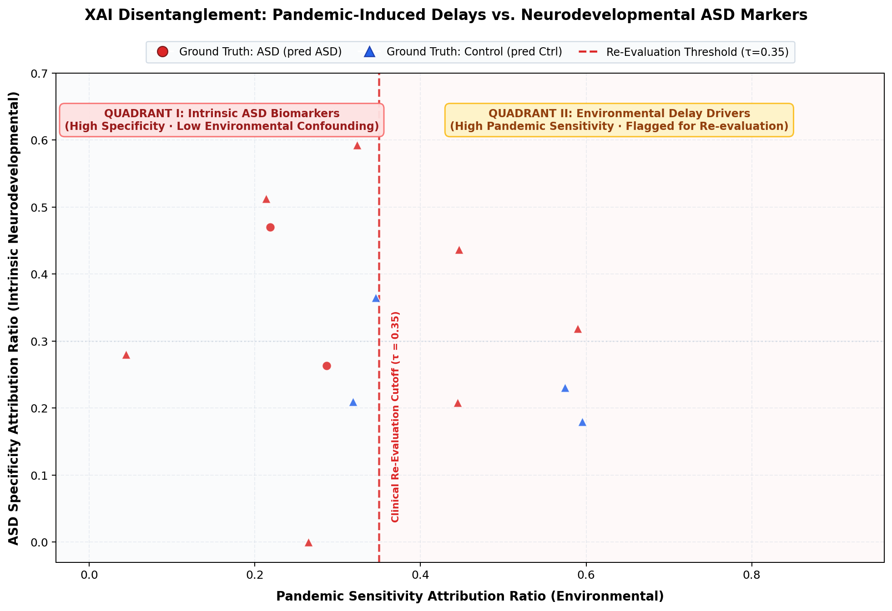

# Clinical XAI Report: Disentangling Environmental Delays from Early ASD

## 1. Executive Summary
This report analyzes multimodal feature attributions to differentiate **pandemic-induced developmental delays** (e.g. speech pauses, limited social modeling, masked facial affect) from **intrinsic neurodevelopmental indicators of Autism Spectrum Disorder (ASD)** (e.g. atypical joint attention gaze shifts, stereotypic vocal cadence).

- **Total Cohort Evaluated**: 16 aligned pediatric recordings
- **Samples Flagged for Environmental Re-evaluation**: **0**
- **Evaluation Mechanism**: 320D Fused Feature Space partitioned into Pandemic-Sensitive vs. ASD-Specific attributions.

---

## 2. Disentanglement Analysis
The scatter plot below isolates each patient's attribution coordinates along the two diagnostic axes:

---

## 3. Flagged Patient Cohort (Potential Environmental Delay Confounding)
The following patients had positive screening predictions primarily driven by features vulnerable to lockdown social isolation:

| Sample ID | True Diagnosis | Model Risk $P(\text{ASD})$ | Pandemic Sensitivity Ratio | ASD Specificity Ratio |
| :--- | :---: | :---: | :---: | :---: |

---

## 4. Exemplar Patient Case Studies
*No samples exceeded the re-evaluation threshold.*

---
*Report generated automatically by early_autism_screening PandemicContextAnalyzer.*
